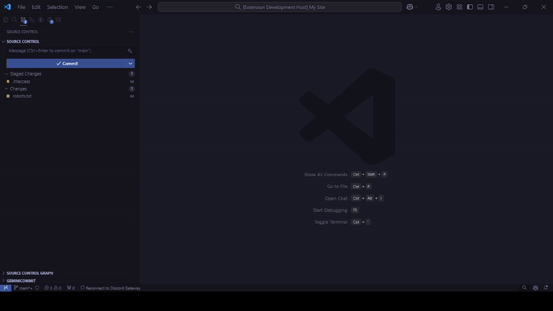

<h2 align="center">
ProCommit
</h2>

📝 A Customizable VS Code extension for AI-generated commit messages.

## Features

- Emoji features.
- Custom Generator, Endpoint, and Api Key.
- Generating commit message using different language.
- Using multiple result for commit messages.
- More customizable.

## Requirements

To use this extension, you need an API Key:
- Obtain an API key from [OpenAI](https://platform.openai.com/account/api-keys) (Default endpoint).
- Alternatively, you can use your own custom API key (Custom endpoint).

## Install
- Download ProCommit Extension From [Marketplace](https://marketplace.visualstudio.com/items?itemName=Kochan.pro-commit)

## Install (Manually)
- Download ProCommit Extension From [Direct Link](https://nightly.link/koimoee/ProCommit/workflows/build/main/ProCommit.vsix.zip) or [VSIX Registry](https://open-vsx.org/extension/Kochan/pro-commit)
- In Visual Studio Code, at the bottom of the Activity Bar, click the Extensions icon, and select Install from VSIX. Select the VSIX file ProCommit.vsix and click Install.
- You're done!

## Extension Settings

ProCommit extension contributes the following settings:

### Extension Settings

The extension contributes the following settings (keys and defaults shown):

- `procommit.general.generator` (default: `ChatGPT`): Generator used to create commit messages. Options: `ChatGPT`, `Gemini`, `Ollama`, `LMStudio`, `Smithery`, `Custom`.
- `procommit.general.messageApproveMethod` (default: `Quick pick`): Method used to approve generated commit messages. Options: `Quick pick`, `Message file`.
- `procommit.general.language` (default: `English`): Language used for generated commit messages. Options include `English`, `Japanese`, `Korean`, `German`, `Russian`.
- `procommit.general.showEmoji` (default: `false`): Include emojis in commit messages.
- `procommit.general.useMultipleResults` (default: `false`): When enabled and using the Quick pick approve method, allow choosing from multiple generated results.
- `procommit.apiKey` (default: empty): API key used by generators (OpenAI, Gemini, Smithery, AutoCommit, etc.).
- `procommit.endpoint` (default: empty): Custom endpoint URL for generators. Leave blank to use the default endpoint for the selected generator.
- `procommit.model` (default: `gpt-4o-mini`): Model identifier or version to use for AI generators. Leave blank to use the generator default.
- `procommit.temperature` (default: `0.2`): Controls randomness for generators. Lower values make output more deterministic.
- `procommit.maxTokens` (default: `196`): Maximum number of tokens to generate for commit messages.

These keys map directly to the configuration schema in `package.json` and can be changed in VS Code Settings UI or in workspace/user settings.

## License

Released under the [MIT License](/LICENSE) by [@Kochan](https://github.com/koimoee).

## Contributing

If you want more languages to be supported, please open an issue on our [GitHub repository](https://github.com/koimoee/ProCommit/issues).
