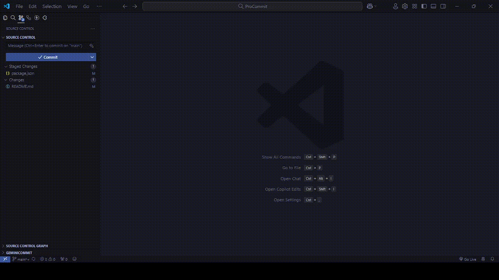

# ProCommit

ProCommit is a VS Code extension that helps generate AI commit messages using ChatGPT or a custom endpoint.

## Features

- Generate commit messages by pressing the 'Generate AI commit' button in the source control tab.
- Alternatively, generate commit messages from the command palette by executing the 'Generate AI commit' command.

## Requirements

To use this extension, you need an OpenAI API Key:
- Obtain an API key from [OpenAI](https://platform.openai.com/account/api-keys).
- Alternatively, use your own API key.

## Extension Settings

ProCommit extension contributes the following settings:

### General

- `procommit.general.generator`: Generator used to create commit messages. Available options: ChatGPT.
- `procommit.general.messageApproveMethod`: Method used to approve generated commit messages. Available options: Quick pick, Message file.
- `procommit.general.language`: Control what language should used for commit message.

### OpenAI

- `procommit.openAI.apiKey`: API Key needed for generating AI commit messages.
- `procommit.openAI.gptVersion`: Version of GPT used.
- `procommit.openAI.customEndpoint`: Custom endpoint URL.
- `procommit.openAI.temperature`: Controls randomness. Lower values result in less random completions. As the temperature approaches zero, the model becomes deterministic and repetitive.
- `procommit.openAI.maxTokens`: The maximum number of tokens to generate. Requests can use up to 2048 tokens shared between prompt and completion.

## License

Released under the [MIT License](/LICENSE) by [@Kochan](https://github.com/koimoee).